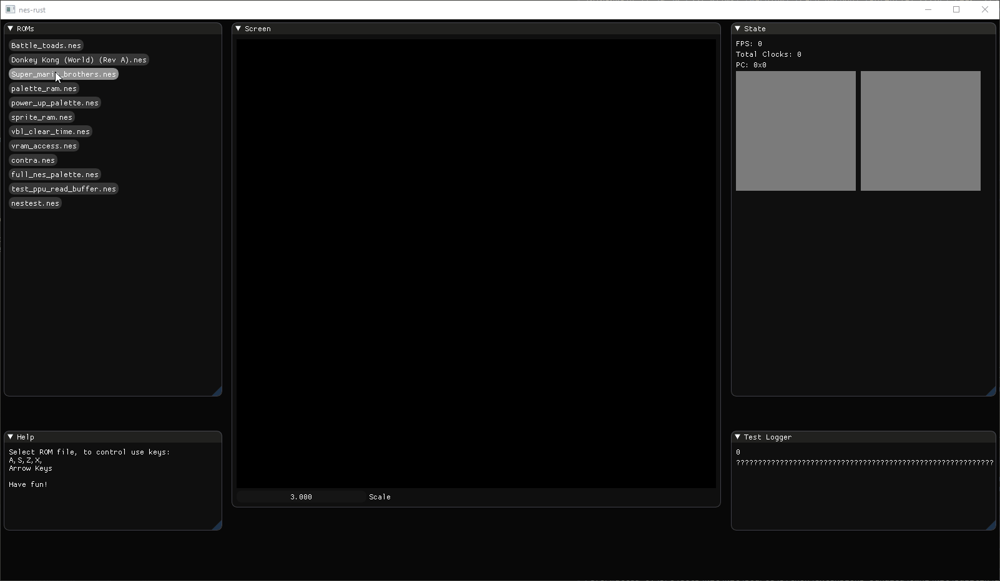

# nes-rust

NES emulator in Rust with GUI



## How to run

```
> cargo run
```


## Acknowledgements & Resources

That was an educational project, thanks to great resources available out there:

* Nesdev Wiki: http://wiki.nesdev.com/w/index.php/Nesdev_Wiki
* 6502 instructions: http://www.obelisk.me.uk/6502/reference.html
* javidx9 videos and sources: https://www.youtube.com/watch?v=F8kx56OZQhg
* other C++ emulator: https://github.com/amhndu/SimpleNES
* nestest.rom from: https://wiki.nesdev.com/w/index.php/Emulator_tests
* ImGui wgpu backend was taken from here: https://github.com/unconed/imgui-wgpu-rs and hacked to add basic support for updating/reuploading textures.
